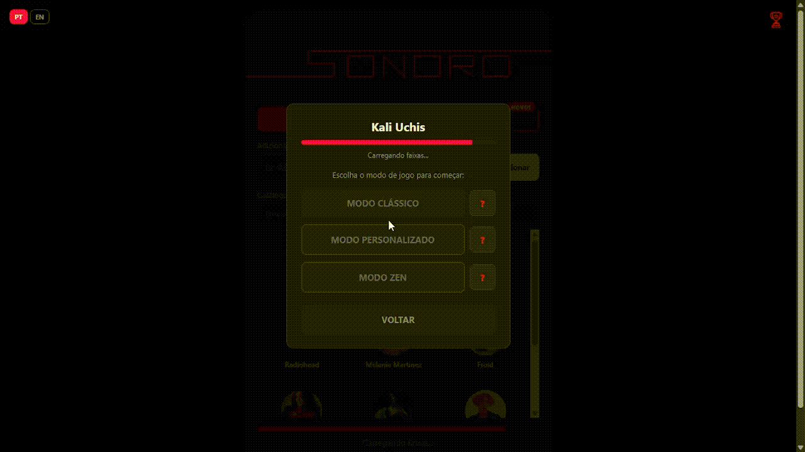
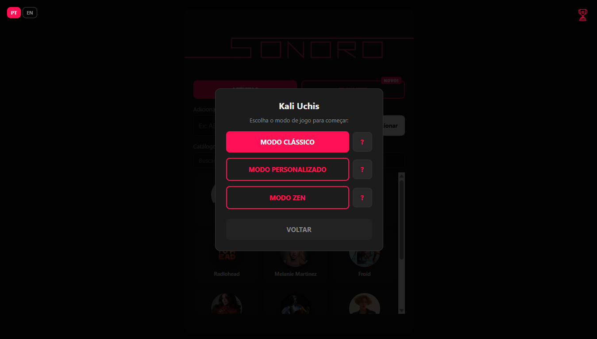
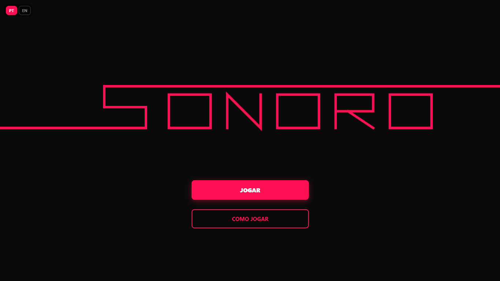
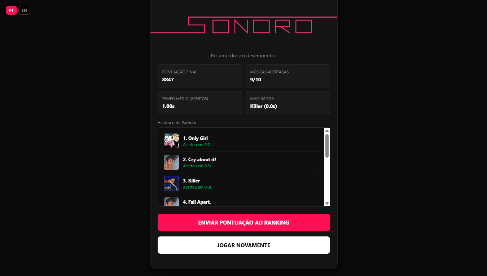
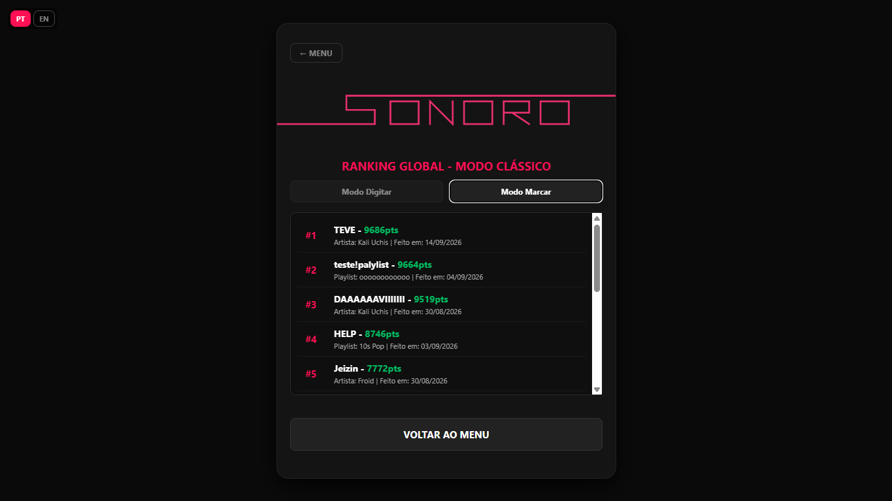

<div align="center">

# SONORO

### Adivinhe a música antes que o tempo acabe!

Um quiz musical feito com HTML, CSS e JS, com músicas puxadas em tempo real da **Deezer API** e ranking global salvo no **Firebase**.

[](https://davi1709.github.io/sonoro/)


</div>

<br>

<div align="center">
  
</div>

<br>

---

## O que é o SONORO?

SONORO é um jogo de adivinhar músicas: você escolhe um artista ou uma playlist, ouve um trecho rápido da faixa e tenta acertar o nome antes do tempo acabar. Quanto menor o trecho e mais rápido você acertar, mais pontos você ganha.

Não tem banco de músicas fixo — qualquer artista ou playlist pública (inclusive suas próprias playlists) da Deezer pode ser jogado, é só colar o nome ou o ID.

<br>

## Modos de Jogo


<div align="center">
  
</div>

| Modo | Descrição |
|---|---|
|  **Clássico** | Trechos cada vez menores e cronômetro apertado. Vale pro ranking global. |
|  **Personalizado** | Você escolhe a duração do trecho, o tempo de resposta, quais álbuns entram e mais. |
|  **Zen** | Sem pressão e sem timer. Só pra curtir e testar seus conhecimentos musicais com calma. |

Em qualquer modo, dá pra responder de dois jeitos:
-  **Digitar** — escreve o nome da música
-  **Marcar** — escolhe entre 5 opções

<br>

##  Funcionalidades

-  Busca de **qualquer artista ou playlist pública** direto da Deezer (por nome ou ID)
-  Visualizador de ondas sonoras em tempo real durante o trecho
-  **Ranking global** por modo de resposta, salvo no Firebase
-  Estatísticas de cada partida: acertos, tempo médio, música mais rápida
-  Interface **bilíngue** (Português e Inglês), com troca instantânea
-  Totalmente responsivo, roda tranquilo no celular

<br>

## Idiomas

O SONORO detecta o idioma do navegador automaticamente na primeira visita, mas você pode trocar a qualquer momento clicando no botão **PT / EN** no canto superior esquerdo. A escolha fica salva pra próxima vez.

<br>

## Mais telas

<div align="center">
  
  
  
</div>

<br>

## Tecnologias

- **HTML5, CSS3 e JavaScript** — sem frameworks, sem build step
- **[Deezer API](https://developers.deezer.com/api)** — busca de artistas, playlists, álbuns e prévias de áudio
- **[Firebase Firestore](https://firebase.google.com/docs/firestore)** — ranking global em tempo real
- **Web Audio API** — visualizador de ondas sonoras reagindo ao áudio

<br>

## Estrutura do Projeto

```
sonoro/
├── index.html          # Estrutura de todas as telas
├── css/
│   └── style.css       # Estilo visual completo
├── js/
│   ├── i18n.js          # Sistema de tradução PT/EN
│   ├── state.js         # Estado global do jogo
│   ├── deezer.js        # Integração com a API da Deezer
│   ├── audio.js         # Player e visualizador de ondas
│   ├── ui.js             # Renderização de telas e ranking
│   └── game.js           # Lógica principal do jogo
└── assets/               # Ícones e imagens
```

<br>

## Se quiser rodar localmente

Como é tudo HTML/CSS/JS puro, não precisa instalar nada. Só:

1. Clone o repositório
   ```bash
   git clone https://github.com/davi1709/sonoro.git
   ```
2. Abra a pasta com um servidor local (por exemplo, a extensão **Live Server** do VS Code) — não abra o `index.html` direto pelo navegador, porque a página usa `fetch` e isso precisa de um servidor.
3. Pronto, é só jogar!

> **Nota:** o ranking global usa uma chave do Firebase própria deste projeto. Se você for clonar e hospedar sua própria versão, vai precisar criar seu próprio projeto no [Firebase Console](https://console.firebase.google.com/) e trocar o `firebaseConfig` dentro do `index.html`.

<br>

## Ideias futuras

- [ ] Mais opções no modo personalizado
- [ ] Novos modos
- [ ] Mais idiomas
- [ ] Modo multiplayer
- [ ] Conquistas 

<br>

## Créditos

Feito por mim: [@davi1709](https://github.com/davi1709), usando dados musicais da [Deezer](https://www.deezer.com/).

<br>

<div align="center">

**[Jogar SONORO agora](https://davi1709.github.io/sonoro/)**

</div>
